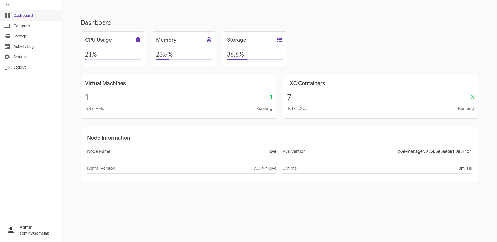
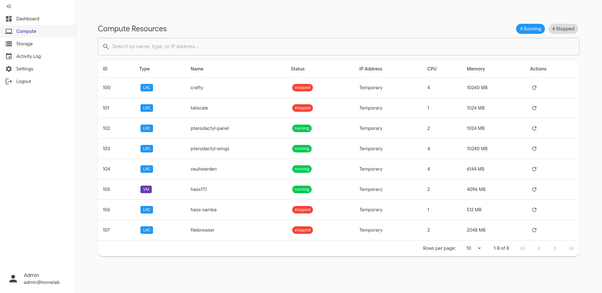
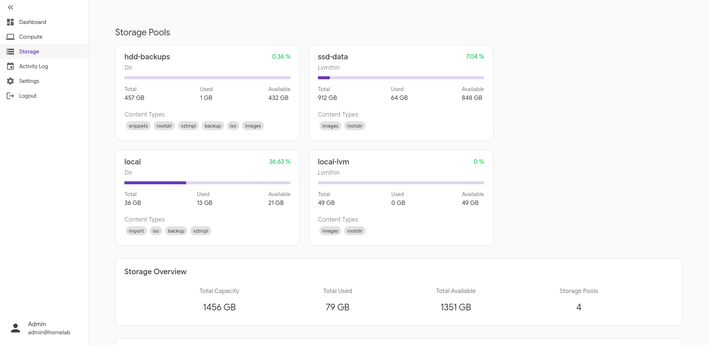
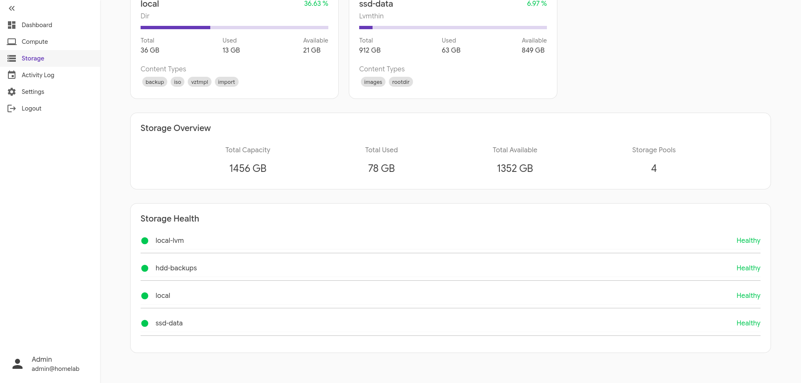
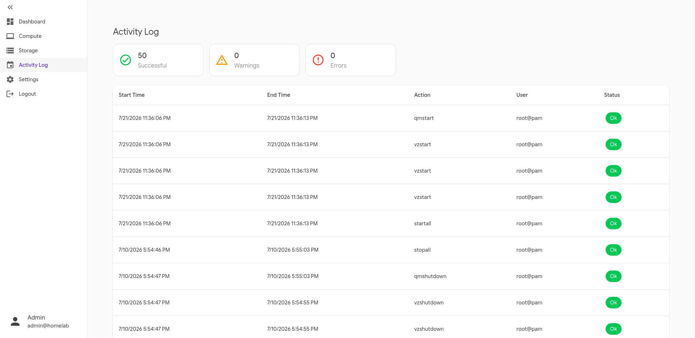
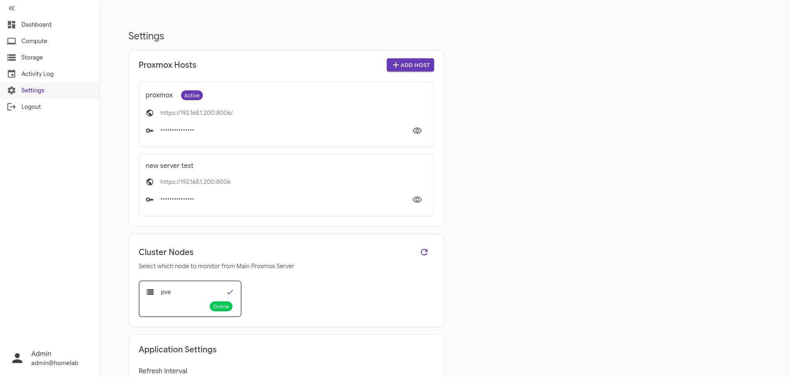

# Homelab Monitor

A Proxmox VE monitoring dashboard built with ASP.NET Core and Blazor.

## Overview
Homelab Monitor provides a real-time view of a Proxmox host's resources, including CPU, memory, storage, virtual machines, LXC containers, and activity logs - all retrieved through the Proxmox API.

## Tech Stack
- **Backend:** ASP.NET Core 10 Web API
- **Frontend:** Blazor (MudBlazor)
- **Database:** PostgreSQL with Entity Framework Core

## Features
- Dashboard with live node metrics
- Compute resources view (VMs and LXC containers)
- Storage pool overview
- Activity log with status tracking
- Settings for managing Proxmox host connections

## Screenshots

<figure align="center">
    
</figure>

<figure align="center">
    
</figure>

<figure align="center">
    
</figure>

<figure align="center">
    
</figure>

<figure align="center">
    
</figure>

<figure align="center">
    
</figure>